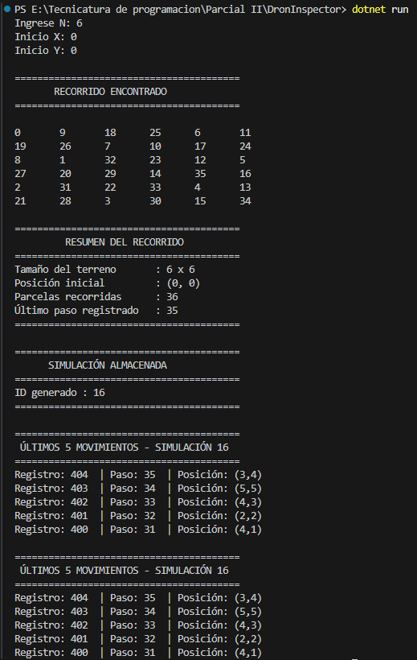

# DronInspector

## Descripción

Este proyecto fue desarrollado como resolución de un trabajo práctico/parcial de Programación .NET.

El objetivo consiste en simular el recorrido de un dron sobre un terreno cuadrado de tamaño **N x N**, donde el dron se desplaza utilizando movimientos equivalentes a los de un caballo de ajedrez (2 posiciones en una dirección y 1 en otra).

El sistema busca recorrer la mayor cantidad posible de parcelas del terreno partiendo desde una posición inicial indicada por el usuario.

Además, cada simulación realizada se almacena en una base de datos PostgreSQL para mantener un historial de ejecuciones.


## Funcionalidades implementadas

### Generación del recorrido

* Ingreso del tamaño del terreno (N).
* Ingreso de las coordenadas iniciales del dron.
* Validación de datos ingresados.
* Cálculo automático del recorrido.
* Visualización del recorrido en consola.

### Algoritmo utilizado

Para resolver el problema se implementó una solución recursiva utilizando:

* Backtracking.
* Heurística de menor grado (Warnsdorff).
* Conteo previo de parcelas alcanzables.

Esto permite encontrar recorridos válidos de manera eficiente incluso en tableros grandes.


## Persistencia de datos

Cada simulación realizada se guarda en PostgreSQL mediante dos tablas:

### tb_master_control

Almacena información general de la simulación:

* Fecha de ejecución.
* Tamaño del terreno.
* Coordenadas iniciales.

### tb_det_log

Almacena cada movimiento realizado por el dron:

* Número de paso.
* Coordenada X.
* Coordenada Y.

---

## Ofuscación de pasos

Antes de guardar los movimientos en la base de datos se aplica una transformación a los números de paso:

* Si el paso es par → se multiplica por 2.
* Si el paso es impar → se almacena como negativo.

Posteriormente el sistema es capaz de reconstruir el valor original al consultar los datos.


## Consulta de movimientos

El sistema permite recuperar los últimos 5 movimientos almacenados para una simulación y mostrar:

* ID del registro.
* Paso reconstruido.
* Posición del dron.

## Ejemplo de ejecución



## Tecnologías utilizadas

* C#
* .NET 10
* PostgreSQL
* Docker
* DBeaver
* Npgsql


## Estructura del proyecto

```text
DronInspector
│
├── Models
│   ├── Movimiento.cs
│   └── Simulacion.cs
│
├── Services
│   ├── DroneSolver.cs
│   └── DatabaseService.cs
│
├── Data
│   └── Script.sql
│
├── Program.cs
├── appsettings.json
└── DronInspector.csproj
```


## Ejecución

1. Crear la base de datos PostgreSQL.
2. Ejecutar el script SQL incluido en la carpeta Data.
3. Configurar la cadena de conexión en `appsettings.json`.
4. Ejecutar el proyecto:

```bash
dotnet run
```

5. Ingresar:

   * Tamaño del terreno.
   * Coordenada X inicial.
   * Coordenada Y inicial.

El programa mostrará el recorrido encontrado, guardará la simulación en la base de datos y finalmente mostrará los últimos movimientos registrados.


## Autor

Braian E Barrionuevo

Trabajo realizado para la materia Programación III
